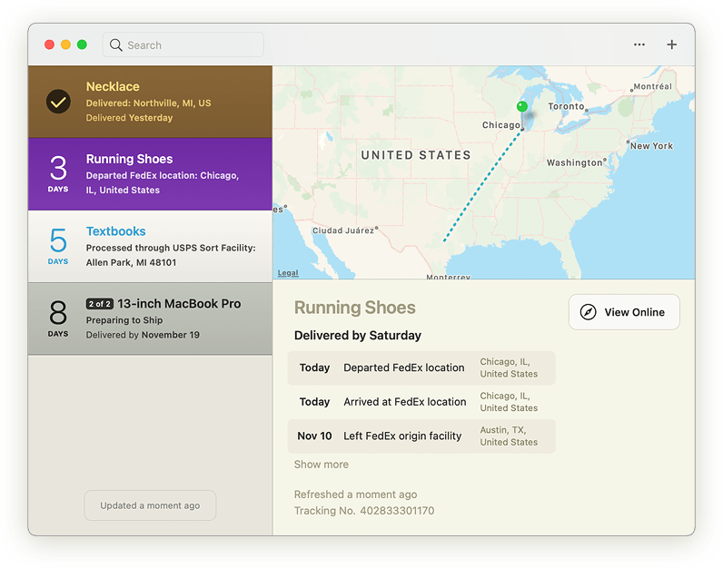
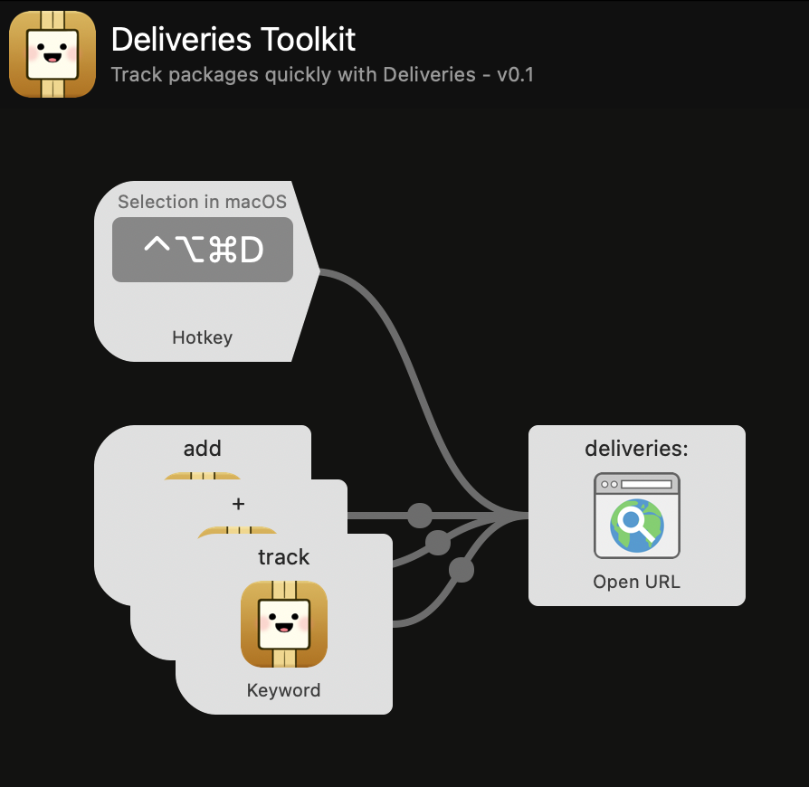

# Deliveries Toolkit for Alfred

The Deliveries Toolkit for Alfred makes it easy to track packages with [Deliveries for Mac](https://deliveries.app/).

Deliveries supports dozens of services, including UPS, FedEx, US Postal Service, DHL, TNT, Canada Post, DPD, and [many more](https://junecloud.com/software/iphone/deliveries.html#services). You can also track orders from services like Amazon and Apple, even before they ship.

## Installation

1. Download [deliveries-toolkit.alfredworkflow](https://github.com/chrismessina/alfred-deliveries-toolkit/releases/latest/download/deliveries-toolkit.alfredworkflow).
2. Double-click `deliveries-toolkit.alfredworkflow` to install it.

_You will need [Alfred Powerpack](https://www.alfredapp.com/powerpack/) to enable this workflow._

## Usage

Use one of the keywords (<kbd>add</kbd>, <kbd>track</kbd>, or <kbd>+</kbd>) followed by a space and then a tracking number to add it to Deliveries:

**Recommended**: Add a hotkey trigger to send selected text to Deliveries!

## Changelog[¹](https://keepachangelog.com/)

### [v0.1.0] - 2020-12-13
- Initial Release

## About
This workflow is unaffiliated with nor endorsed by JuneCloud. Package Pal icon is by Holly Piontek.

You can [file bugs](https://github.com/chrismessina/alfred-deliveries-toolkit/issues/new) or [submit feature requests](https://github.com/chrismessina/alfred-deliveries-toolkit/issues/new) on GitHub using the label `enhancement`.

Discuss on <a href="https://www.alfredforum.com/topic/16318-track-holiday-deliveries-with-alfred-%F0%9F%8E%85%F0%9F%8F%BB%F0%9F%93%A6/">Alfred Forum</a>.

## License

Apache 2.0 © [Chris Messina](https://github.com/chrismessina)
